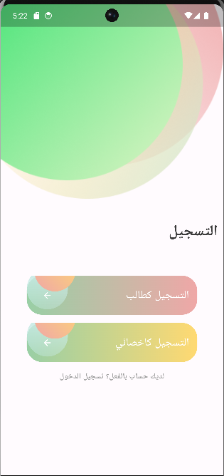
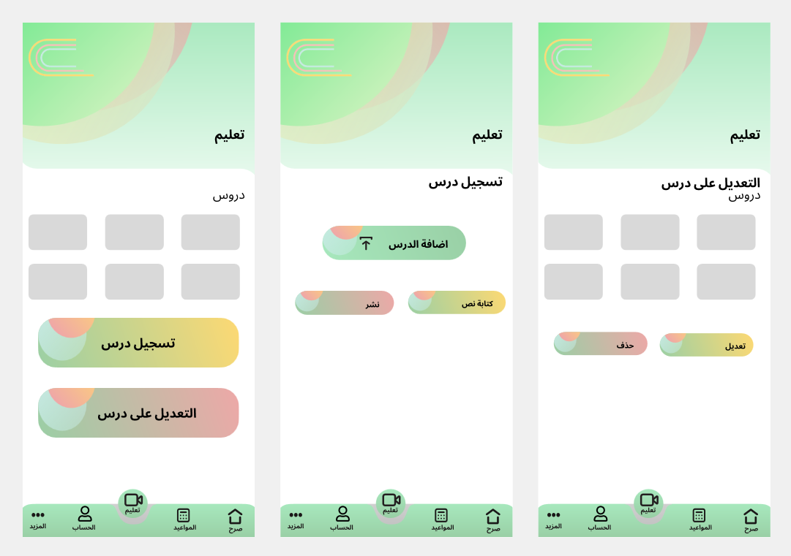
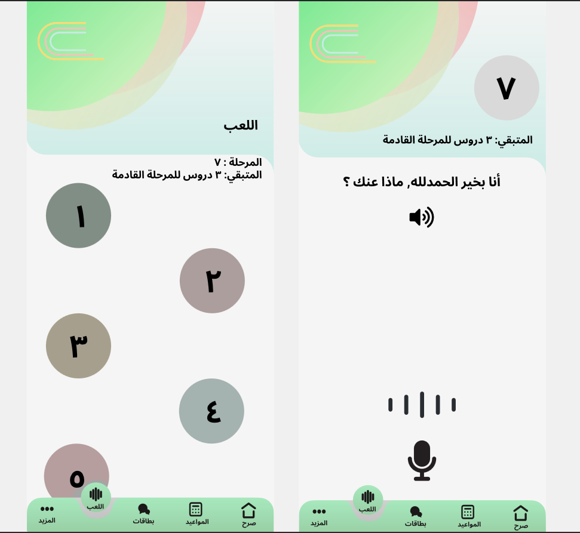

# 🌟 SARH – Your AI Companion for Speech Therapy

**SARH** is an innovative mobile application designed to support individuals with communication disorders. It leverages machine learning and modern mobile technologies to deliver accessible and interactive speech therapy.

---

## 🧠 Key Features

- 🎤 **Speech Error Detection**  
  Uses machine learning to analyze spoken input and identify common speech errors for targeted feedback.

- 🧑‍⚕️ **Online Speech Therapy Sessions**  
  Connects users with certified speech-language therapists for real-time, personalized therapy sessions.

- 🧩 **AAC (Augmentative and Alternative Communication) Cards**  
  Offers a digital AAC board to assist non-verbal individuals in expressing their needs and feelings.

- 🎥 **Free Video Lessons**  
  Provides engaging educational videos designed by experts to support independent learning and practice.

---

## 📱 Technologies Used

- **Flutter & Dart** – Cross-platform mobile app development  
- **TensorFlow / scikit-learn** – Machine learning models for speech error analysis  
- **FastAPI / Flask** – Backend services and APIs  
- **Firebase** – Authentication and real-time database  
- **Python** – Model training and backend logic  

---

## 🚀 Getting Started

### Prerequisites

- Flutter SDK  
- Python 3.8+  
- Android Studio or Xcode (for emulators)

### Installation

```bash
git clone https://github.com/zahraabdulrahman/sarh.git
cd sarh
flutter pub get
```

## 🖼️ Preview




